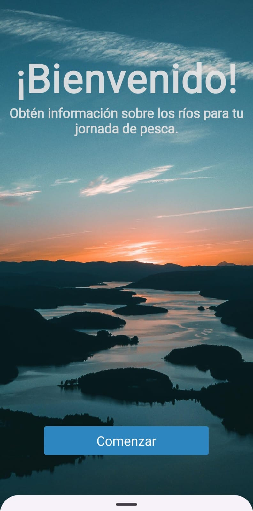
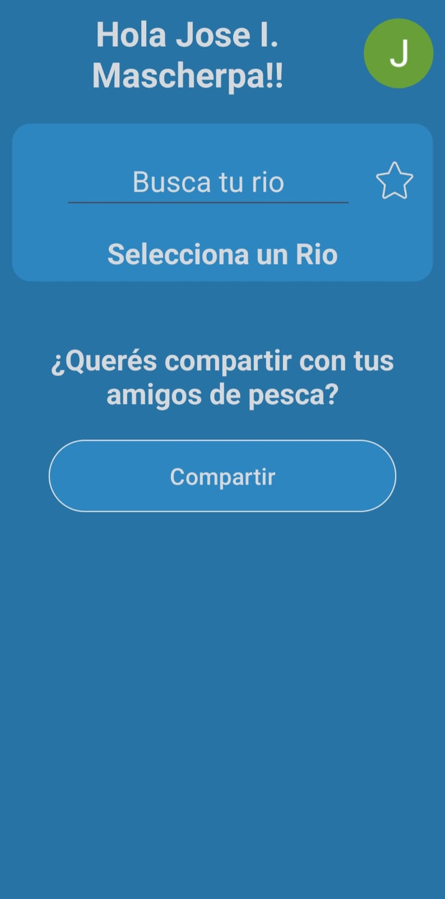
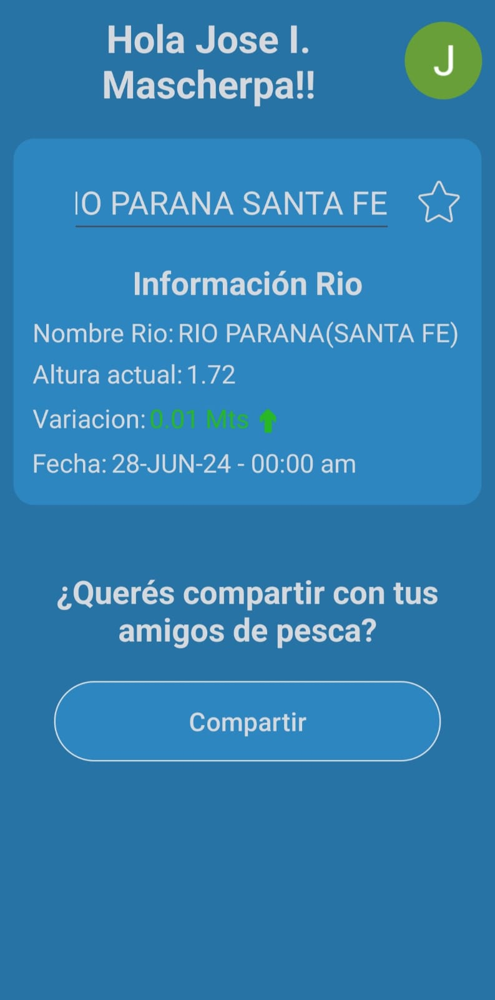

  <h1>🐟Dia de Pesca🎣</h1> 
Como soy un amante de la pesca y suelo ir bastante seguido, decidí utilizar mis conocimientos para programar una aplicación a modo de práctica y aprendizaje, utilizando la técnica de web scraping. Principalmente, la creé con el objetivo de ahorrarme tener que ingresar cada vez a la página de la Prefectura y verificar la altura del río. Para solucionar este 'problema', desarrollé la aplicación para hacerlo más simple.
La aplicación muestra la altura del río, la variación y las fechas de actualización. Además, cuenta con un botón de favorito para que puedas agregar cualquier río y no tengas que volver a buscarlo cada vez que abres la app,y un botón para compartir la información a distintas redes sociales!, y posibilidad de desconectar/eliminar la cuenta.

 

  
  
  
  

 
  <b>:abcd: Lenguaje:</b> Java. 
  <b>:page_facing_up: Ide:</b> Android studio. 
  <b>:fire: Firebase:</b> utilizado para autenticación con google y base de datos en tiempo real.   
  <b>:books: Librerias:</b>  
  <ul><li>Jsoup: utilizada para extraer los datos del html de la pagina de prefectura. </li>
  <li>Glide: mostrar imagen de google, a traves del link.</li>
  <li>LottieFiles: uso de animaciones con json.</li></ul>            

  <b>:camera:Imagenes::camera:</b>
  
  

  <b>:movie_camera:Video funcionalidades::movie_camera:</b>
  [Youtube](https://www.youtube.com/shorts/4yJdSjCJFYc)
  
  <b>:arrow_down: Enlace apk:</b>
  [Link Drive apk](https://drive.google.com/file/d/14knb03M0Qwfn56BZTNv1TwRmZp8JOPMx/view?usp=sharing)

  
  
  
  
